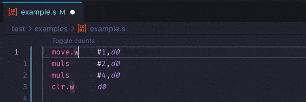
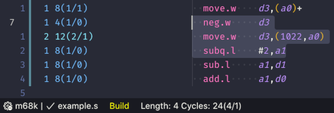

# 68k Counter for VS Code

Displays cycle and size information for 68000 assembly source.

## Features

### Gutter annotations

Provides annotations for each line of code to show:

- Size in words
- CPU cycles
- Bus read cycles
- Bus write cycles

Click 'Toggle counts' at the top of a file to enable these. These counts live-update as you edit the code.

### Calculate totals

Totals cycles and size across a range of lines. Either:

- Select some text with count annotations enabled and the totals will be displayed in the status bar at the bottom of the screen.

  

- Call `68kcounter: Count selection` from the command palette with some text selected.

## Requirements

An extension which provides a 68000 assembly language definition:

- [Amiga Assemebly](https://marketplace.visualstudio.com/items?itemName=prb28.amiga-assembly)
- [m68k](https://marketplace.visualstudio.com/items?itemName=steventattersall.m68k)
- [Motorola 68k Assembly](https://marketplace.visualstudio.com/items?itemName=clcxce.motorola-68k-assembly)
